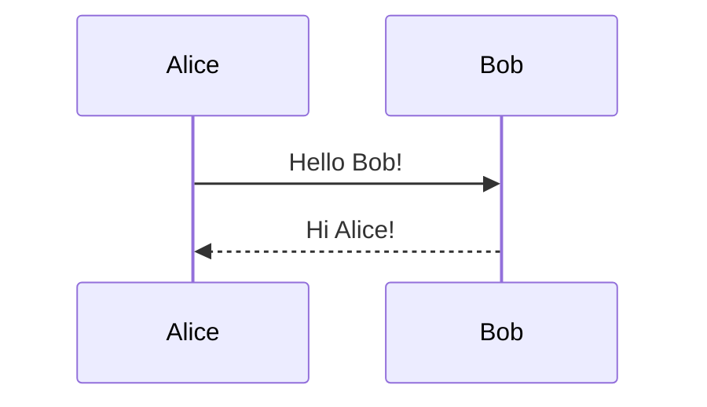

# Toolkit

A collection of practical tools for technical writing, code analysis, and document processing. These tools help break down large files, analyze code changes, and convert diagrams for better AI interaction and documentation workflows.

## 🚀 Quick Start

```bash
git clone https://github.com/JoshWrites/Toolkit.git
cd Toolkit
```

## 📦 Tools Overview

### 1. **File Sharder** - Break down large code files for AI analysis
### 2. **Literary Text Sharder** - Process literary works with AI-powered analysis
### 3. **Diff Simple** - Compare Python function changes between git branches
### 4. **Mermaid Converter** - Convert Mermaid diagrams to Google Slides

## 🛠️ Tool Documentation

<details>
<summary><h3>📄 File Sharder v1.1</h3></summary>

A multi-language tool for breaking down large source code files into smaller, manageable "shards" for easier analysis by AI language models.

**Supported Languages:**
- Python (.py) - Full AST-based parsing
- C++ (.cpp, .cxx, .cc, .hpp, .h) - Regex-based parsing

**Features:**
- Multiple sharding strategies (by type, name pattern, docstring, or even distribution)
- Smart detection of functions, classes, and methods
- Preservation of imports and global variables across all shards
- Enhanced index with detailed function metadata
- Automatic file type detection

**Usage:**
```bash
python file_sharder_v1.1.py
```

Follow the interactive prompts to:
1. Specify the source file to shard
2. Select an output directory
3. Choose a sharding strategy
4. Set the maximum elements per shard

**Output:**
- Language-specific directory: `{filename}_{lang}_shards_{timestamp}/`
- Multiple source files (shards) with portions of the original code
- Enhanced index: `{filename}_{lang}_index_{timestamp}.json`
- README.md with usage instructions

</details>

<details>
<summary><h3>📚 Literary Text Sharder v1.1</h3></summary>

An intelligent tool for breaking down large literary works into thematic shards using local AI analysis. Perfect for analyzing books, manuscripts, or any lengthy text.

**Features:**
- Automated discovery of characters, themes, and literary elements
- Multiple sharding strategies based on discovered content
- Integration with local AI services (Msty/Ollama)
- Zero manual preprocessing required
- On-the-fly shard writing to prevent memory overflow

**Requirements:**
- Python 3.9+
- Msty app or Ollama running locally with Llama 3.2 (or compatible model)
- `requests` library

**Setup:**
```bash
pip install requests
# Start Msty/Ollama with Llama 3.2 model
```

**Usage:**
```bash
python Literary_Text_Sharder_v1-1.py
```

The tool will:
1. Connect to your local AI service
2. Analyze the text to discover characters and themes
3. Create intelligent shards based on your chosen strategy
4. Generate an index with metadata for each shard

**Output:**
- Shards directory: `{filename}-Literary-Shards-{timestamp}/`
- Character-based or theme-based text segments
- `literary_index.json` with discovered metadata

</details>

<details>
<summary><h3>🔍 Diff Simple</h3></summary>

A streamlined Python code comparison tool that analyzes function-level changes between git branches.

**Features:**
- AST-based function extraction
- Line-by-line comparison of function bodies
- CSV output for easy analysis
- Identifies added, removed, and modified functions

**Usage:**
```bash
python diff_simple.py <branch1> <branch2> <file_path>
```

**Example:**
```bash
python diff_simple.py main feature-branch src/utils.py
```

**Output:**
- Summary of changes to stdout
- `function_changes.csv` with detailed comparison:
  - Function names
  - Change types (added/removed/modified)
  - Line numbers
  - Function body content

</details>

<details>
<summary><h3>📊 Mermaid Converter</h3></summary>

A Google Apps Script tool that converts Mermaid sequence diagrams into native shapes and connectors in Google Slides.

**Features:**
- Creates actual shapes, lines, arrows, and text boxes
- Supports sequence diagram participants, messages, and notes
- Handles alt/else conditionals and opt blocks
- Proper positioning and sizing of elements

**Usage:**
1. Open Google Slides
2. Extensions → Apps Script
3. Copy the contents of `fixed-mermaid-converter.js`
4. Replace the sample Mermaid code with your diagram
5. Run `createMySequenceDiagram()`
6. The diagram will be created on the current slide

**Example Mermaid Code:**


**Supported Elements:**
- Participants with aliases
- Solid arrows (->>)
- Dashed arrows (-->>)
- Notes over participants
- Alt/else conditional blocks
- Opt optional blocks

</details>

## 📋 Requirements

### General Requirements:
- Python 3.9+ (for Python tools)
- Git (for diff_simple.py)
- Google account (for mermaid converter)

### Tool-Specific Requirements:
- **File Sharder**: None (uses Python standard library)
- **Literary Text Sharder**: `requests` library, Msty/Ollama with LLM
- **Diff Simple**: Git repository
- **Mermaid Converter**: Google Slides access

## 🤝 Contributing

Feel free to submit issues and enhancement requests!

1. Fork the repository
2. Create your feature branch (`git checkout -b feature/amazing-feature`)
3. Commit your changes (`git commit -m 'Add some amazing feature'`)
4. Push to the branch (`git push origin feature/amazing-feature`)
5. Open a Pull Request

## 📝 License

This project is licensed under the GPL-3.0 License - see the [LICENSE](LICENSE) file for details.

## 🔗 Links

- Repository: [https://github.com/JoshWrites/Toolkit](https://github.com/JoshWrites/Toolkit)
- Issues: [https://github.com/JoshWrites/Toolkit/issues](https://github.com/JoshWrites/Toolkit/issues)